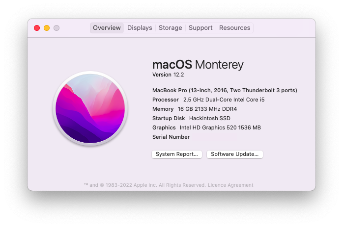

# OpenCore EFI for ThinkPad X270
This repository contains my personal OpenCore EFI configuration for the Lenovo ThinkPad X270.

## Currently running
- macOS 12.2.1 Monterey
- OpenCore 0.7.9

## Laptop's Hardware
| Component        | Model                            |
| ---------------- | -------------------------------- |
| CPU              | Intel Core i5 6300U              |
| GPU              | Intel HD Graphics 520            |
| RAM              | 16GB DDR4                        |
| WiFi & Bluetooth | Intel Dual Band Wireless-AC 8260 |
| Ethernet         | Intel Ethernet I219-LM           |
| Audio Codec      | ALC298                           |
